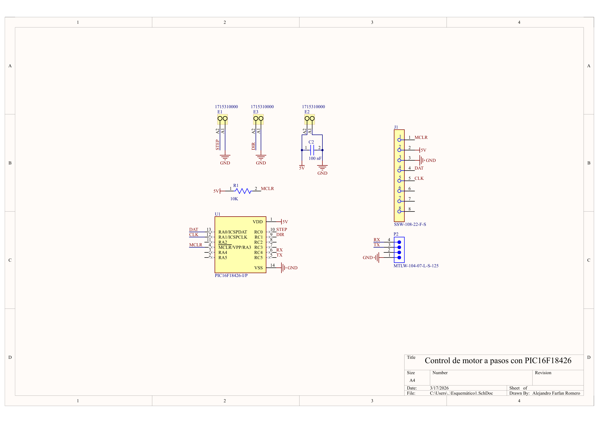
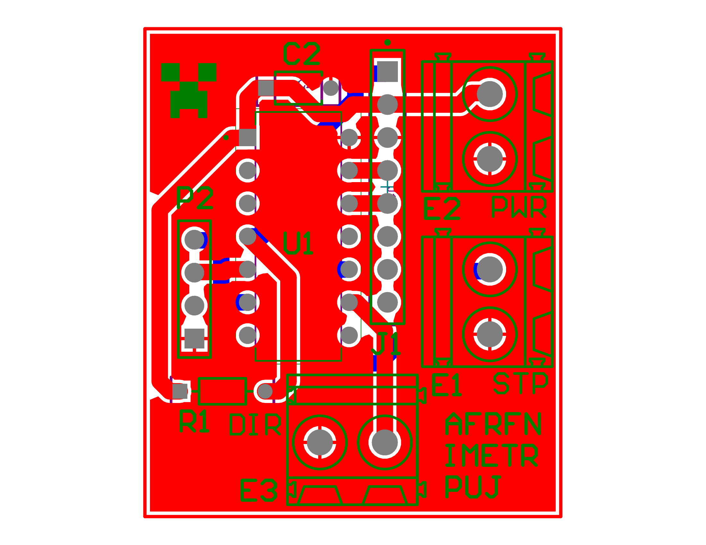

# Controlador de motor a pasos con PIC16F18426 usando NCO y comunicación serial

## Descripción
Este proyecto implementa un controlador embebido para un motor a pasos basado en el microcontrolador **PIC16F18426**. El sistema genera la señal **STEP** usando el periférico **NCO (Numerically Controlled Oscillator)**, gestiona la dirección del motor desde firmware y recibe comandos por **puerto serial** para ejecutar movimientos de posición.

El desarrollo nace en el contexto de una práctica de laboratorio orientada al diseño de un actuador lineal o rotacional controlado por comandos estándar, con reporte de posición en tiempo real.

## Demostración del funcionamiento

A continuación se muestra una demostración del funcionamiento general del sistema:


Este registro visual permite observar el comportamiento del motor ante los comandos enviados por comunicación serial y verificar la respuesta del sistema durante la ejecución del movimiento.


## Objetivo del proyecto
Construir un sistema de control de movimiento que permita:

- mover un motor a pasos a una posición objetivo.
- configurar parámetros de movimiento por comunicación serial.
- enviar la posición actual en tiempo real.
- servir como base para un actuador rotacional o translacional de alta precisión.

## Contexto académico
La práctica asociada plantea, entre otros requisitos:

- control del motor a pasos por medio de un microcontrolador.
- recepción de comandos por puerto serial.
- implementación de comandos tipo G-code.
- envío de la posición en tiempo real a **10 Hz**.

## Arquitectura general
El sistema se divide en varios bloques funcionales:

### 1. Control de movimiento
Responsable de:

- almacenar el estado actual del motor.
- gestionar posición actual y posición objetivo.
- definir sentido de giro.
- iniciar o detener el movimiento.
- actualizar la frecuencia de pasos.

### 2. Generación de pulsos STEP con NCO
La salida STEP se genera con el periférico **NCO1** del PIC16F18426. Esto permite:

- producir una frecuencia precisa sin cargar continuamente la CPU,
- ajustar dinámicamente la velocidad del motor modificando el valor de incremento,
- trabajar con el modo de salida **FPM** dado que genera una señal de paso como la requerida para el manejo del driver

### 3. Comunicación serial
La interfaz UART permite:

- recibir comandos desde un PC.
- configurar el comportamiento del sistema.
- solicitar o transmitir el estado actual.
- reportar la posición periódicamente.

### 4. Temporización e interrupciones
Se usan interrupciones para separar tareas en tiempo real, por ejemplo:

- actualización de la posición,
- sincronización del movimiento.

## Hardware base
### Microcontrolador
- **PIC16F18426**
- Frecuencia de operación de **32 MHz**
- Periféricos útiles para este proyecto:
  - **1 NCO**
  - **1 EUSART**
  - **timer1**
  - **PPS** para remapeo de periféricos

### Etapa de potencia
Este proyecto asume un driver externo para motor a pasos, por ejemplo:

- DRV8825
- A4988
- TB6600 (usado en la implementación final)

Con señales mínimas:

- `STEP`
- `DIR`

## Diseño electrónico

Como parte del desarrollo del sistema, se realizó el diseño del hardware de soporte para el microcontrolador y la interfaz con el driver del motor a pasos. A continuación se presentan tanto el esquemático como el diseño de la PCB del sistema implementado.

### Esquemático



El esquemático incluye la etapa de control basada en el **PIC16F18426**, la configuración de alimentación, la interfaz serial y las señales de control dirigidas al driver del motor.

### PCB



La PCB fue diseñada para integrar de manera compacta la etapa de control y facilitar la conexión con el sistema de potencia y el motor. Su diseño busca simplificar pruebas, depuración y futura escalabilidad del sistema.


## Funcionamiento esperado
1. El usuario envía un comando por puerto serial.
2. El firmware interpreta el comando y actualiza la referencia de movimiento.
3. El NCO genera la frecuencia de pulsos correspondiente a la velocidad deseada.
4. Un temporizador actualiza la posición estimada del motor y dispara el envío periódico de la posición actual.

## Comandos esperados
Esto depende de la implementación final, pero una interfaz mínima podría incluir:

```text
Mxxx\n        ; mover la posicion deseada
Rxxx\n        ; mover relativamente desde la posicion actual
Fxxx\n        ; fijar la frecuencia (en Hz)
S\n           ; parada de emergencia
```

## Estado actual del desarrollo
Actualmente el proyecto está enfocado en:

- primeros acercamientos reales a la programacion de microcontroladores a bajo nivel.
- comprensión del periférico NCO para obtener frecuencias dinamicas y precisas.
- estructuración del firmware en módulos para sencilla escalabilidad.
- control de malla abierta de movimiento por posición.
- transmisión periódica de la posición por UART.

## Consideraciones de diseño
- El **NCO** permite generar pulsos de STEP con buena resolución y menor carga de CPU.
- La posición reportada puede ser **estimada** a partir de los pasos generados, por lo que depende de no perder pasos mecánicamente.
- La arquitectura modular facilita migrar entre distintos drivers o incluso entre sistemas rotacionales y translacionales.

## Compilación
Este proyecto está pensado para **MPLAB X + XC8**, con apoyo de **MCC Classic** para inicialización de periféricos.

Se incluyó el paquete del proyecto en .zip como lo envía MPLAB para facil integración en otro dispositivo.

## Próximas mejoras
- implementar aceleración trapezoidal.
- soportar cola de instrucciones.

## Autor
Alejandro Farfan Romero, Ingeniería Mecatrónica, Pontificia Universidad Javeriana, Abril 15 2026.
